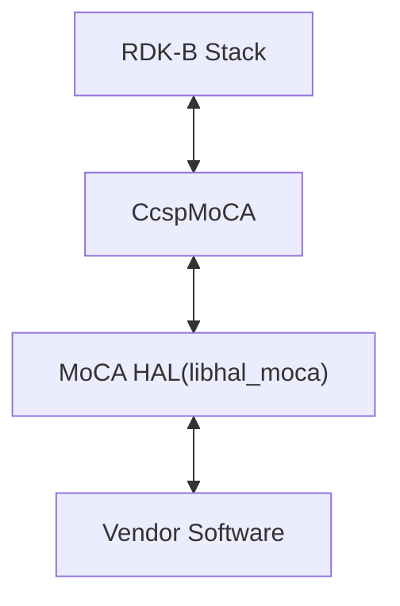
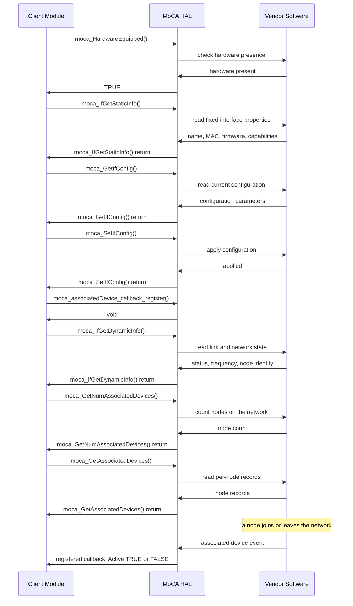
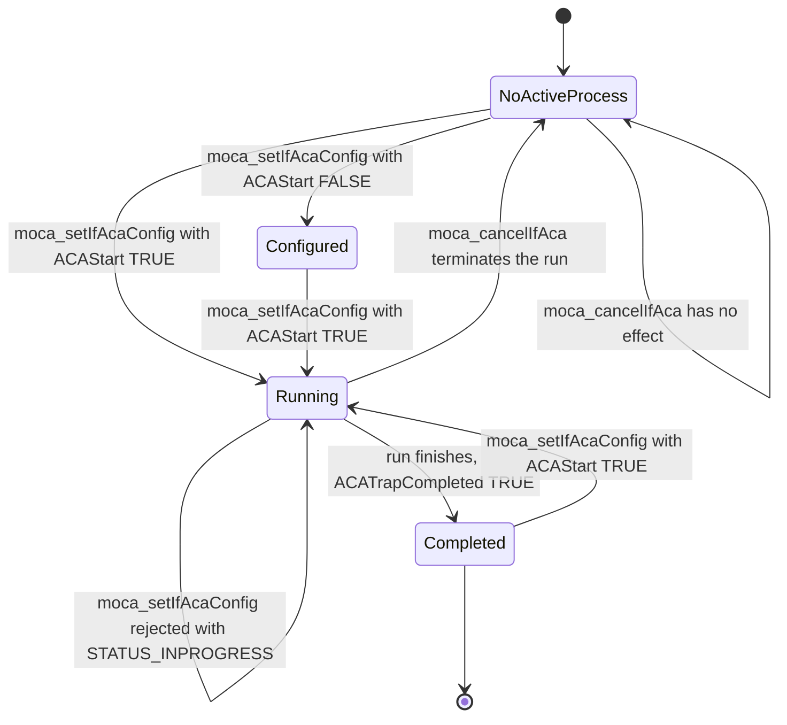

# MoCA HAL Documentation

## Version History

| Date | Comment | Version |
| --- | --- | --- |
| 08/24/26 | Rewritten against the canonical HAL specification topic set. Page renamed from `MoCAHalSpec.md` to `halSpec.md`. Added `Version History`, `Optional Components`, `Data Structures and Defines`, `API Surface` and `State Diagram`; documented the asynchronous notification callback against the header for the first time; corrected the API narrative so that every named identifier is one the header declares. | 1.0.1 |
| 07/29/24 | Initial release of the MoCA HAL interface definition — `RDKB-52502` MoCA HAL header migration to GitHub, `moca_hal.h` update, and refinement following MTA HAL review comments. | 1.0.0 |

Four different version identities apply to this repository and are deliberately kept apart, because
a caller needs a different one in each case.

| Identity | Value | What it is |
| --- | --- | --- |
| Document revision | `1.0.1` | The revision of this specification, as recorded in the table above. |
| Interface version | Not declared | `moca_hal.h` defines **no** interface version macro. The `FirmwareVersion`, `HighestVersion` and `CurrentVersion` members it does declare report the vendor firmware and the MoCA **protocol** version of a node — they are not a version of this interface, and a caller cannot use them to determine which revision of the header a platform was built against. This interface offers no compile-time or run-time version check. |
| Release tag | `1.0.0` | The repository's only git tag, dated 29 July 2024, matching the single section in the changelog. This is the release this document describes. |
| Generated-site version string | `1.0.0-3-g6bde085` | The output of `git describe --tags`, which `docs/generate_docs.sh` passes to the documentation generator as `PROJECT_VERSION`. It denotes the `1.0.0` tag plus three later commits and is **not** a version. |

*Derived from `CHANGELOG.md`, the repository's git tags, `docs/generate_docs.sh`:26,
and `include/moca_hal.h`:265, :267, :287.*

## Acronyms

- `ACA` \- Automatic Channel Adaptation
- `CPE` \- Customer Premises Equipment
- `EVM` \- Error Vector Magnitude
- `HAL` \- Hardware Abstraction Layer
- `MoCA` \- Multimedia over Coax Alliance
- `NC` \- Network Coordinator
- `OEM` \- Original Equipment Manufacture
- `PHY` \- Physical Layer
- `PQoS` \- Priority Quality of Service
- `RDK-B` \- Reference Design Kit for Broadband Devices
- `SCMOD` \- Subcarrier Modulation
- `SLA` \- Service Level Agreement

*Bounded to the terms this document uses. Expansions are taken from `include/moca_hal.h` — `ACA` at
:458, `CPE` at :165, `EVM` at :210, `PQoS` at :404, `SCMOD` at :801 and `NC` at :434.*

## Description

The diagram below describes a high-level software architecture of the MoCA HAL module stack.

The MoCA (Multimedia over Coax Alliance) HAL (Hardware Abstraction Layer) is a component within the
RDK-B (Reference Design Kit Broadband) framework designed to facilitate interaction with MoCA
network adapters. Its primary purpose is to provide a standardized interface that allows
higher-level software components to access and control MoCA functionalities, regardless of the
specific underlying hardware or vendor implementation.

This repository carries the **interface definition only**. `include/moca_hal.h` declares 21
functions and the data types they exchange; each vendor or `OEM` ships its own implementation behind
that contract as a shared library. Nothing in this repository implements the interface.

For a caller, the interface covers five things:

- **Interface configuration** — read and write the frequency mask, channel scanning, privacy
  passphrase, power limits and bandwidth thresholds of a MoCA interface.
- **Interface information** — static properties that do not change while the interface is up
  (firmware version, MAC address, capability masks) and dynamic properties that do (link status,
  operating frequency, `NC` node identity, connected client count).
- **Statistics and counters** — network-layer, MAC-layer, aggregate and `PQoS` flow statistics, the
  full mesh `PHY` rate table, and the module reset count.
- **Associated devices** — enumerate the nodes on the MoCA network, and receive an asynchronous
  notification when one joins or leaves.
- **`ACA`** — configure, start, cancel and read back an Automatic Channel Adaptation run, plus the
  `SCMOD` statistics it produces.

**How to read this document.** `Description` and `Component Runtime Execution Requirements` answer
"what is this and how do I call it". `Non functional requirements` and `Interface API Documentation`
answer the protocol-level questions — exact identifiers, data structures, call ordering, return-code
semantics and state transitions. "API Surface" is the boundary between the two: a reader who came
for the overview can stop above it.

*Derived from `include/moca_hal.h`:59-66 and :509-816, and from the architecture chain carried by the
predecessor of this page. The superproject inventory corroborates this scope — interface bring-up
and configuration, static and dynamic interface information, statistics, and associated-device
enumeration.*

## Optional Components

The following parts of the interface are optional; the rest of it is not.

- **`moca_GetFullMeshRates` and the mesh `PHY` rate table.** This function and the
  `moca_mesh_table_t` structure it fills are compiled only when `MOCA_VAR` is **not** defined, as are
  `moca_if_status_t` and `moca_dynamic_info_t`. A build that defines `MOCA_VAR` exposes a smaller
  interface. See "Platform or Product Customization" for the
  full consequence.
- **The associated-device notification callback.** `moca_associatedDevice_callback_register` is
  optional: a caller that polls `moca_GetNumAssociatedDevices` and `moca_GetAssociatedDevices` never
  has to register one. A caller that does register one receives node join and leave events
  asynchronously instead of polling for them.

No other component of this interface is optional, and this repository declares no optional external
daemon or library that a vendor may substitute.

*Derived from `include/moca_hal.h`:189, :277, :385, :680 (the `MOCA_VAR` guards) and :492 (the
callback registration).*

## Component Runtime Execution Requirements

The requirements in this block apply to every implementation of this interface. Failure to meet them
will result in undefined behaviour in the calling middleware.

### Initialization and Startup

**This interface exposes no initialization or teardown entry point.** None of the 21 declared
functions opens, initializes, closes or de-initializes the MoCA subsystem, and the interface
declares no session handle, no context object and no paired create and destroy calls. Bringing the
MoCA hardware and the vendor software into a usable state happens out of band — in the vendor's own
start-up path, its driver load, or its own daemon — and is not something a caller performs or can
observe through this interface.

The practical consequence for a caller is that there is no initialization call to sequence against,
and no return code that means "not initialized yet". The available readiness signal is
`moca_HardwareEquipped`, which reports whether MoCA hardware is present and correctly configured on
the system.

RDK-B's MoCA Hardware Abstraction Layer (HAL) is responsible for setting up the MoCA interface on a
device. This involves starting up the interface and adjusting its parameters, including frequency
band, channel, and encryption settings. The HAL provides a collection of APIs that allow developers
to interact with the MoCA hardware and manage the interface configuration.

A caller's normal bring-up order is:

- `moca_HardwareEquipped()` \- confirm MoCA hardware is present before calling anything else.
- `moca_IfGetStaticInfo()` \- read the interface name, MAC address, firmware version and capability
  masks, which do not change while the interface is up.
- `moca_GetIfConfig()` \- read the configuration currently in force.
- `moca_SetIfConfig()` \- apply configuration, having first read it back so that unmodified members
  are preserved.
- `moca_associatedDevice_callback_register()` \- register the notification callback, if the caller
  wants node join and leave events rather than polling for them.
- `moca_IfGetDynamicInfo()` \- read link status and the current operating state.
- `moca_IfGetStats()`, `moca_GetNumAssociatedDevices()` and `moca_FreqMaskToValue()` \- routine
  monitoring and mask interpretation thereafter.

Third party vendors will implement appropriately to meet operational requirements.

Before the vendor's MoCA subsystem is ready, a call may not return promptly; see "Blocking calls",
which states what is and is not specified about that window.

*Derived from `include/moca_hal.h`:509-816 (the complete declaration set, which contains no
lifecycle call) and :672-678 (`moca_HardwareEquipped`).*

### Threading Model

Vendors may implement internal threading and event mechanisms to meet their operational
requirements. These mechanisms must be designed to ensure thread safety when interacting with HAL
interface. Proper cleanup of allocated resources (e.g., memory, file handles, threads) is mandatory
when the vendor software terminates or closes its connection to the HAL.

This interface is not inherently required to be thread-safe. It is the responsibility of the calling
module or component to ensure that all interactions with the APIs are properly synchronized.

This is a deliberate property of the MoCA HAL and differs from other RDK-B HALs, some of which
require the implementation itself to be thread safe. A caller must not carry an assumption of thread
safety over from another HAL: concurrent calls into this interface from more than one thread must be
serialized by the caller.

One consequence is specific to the notification callback. The callback registered through
`moca_associatedDevice_callback_register` is invoked by the implementation, not by the caller, so its
execution context is outside the caller's own call sequence. A caller that both polls and registers
a callback must therefore serialize its own state against both paths. See "Asynchronous Notification
Model".

*Derived from the runtime policy stated by the predecessor of this page, retained here as this
repository's own statement, and from `include/moca_hal.h`:483-492.*

### Process Model

All APIs are expected to be called from multiple processes. Due to this concurrent access, vendors
must implement protection mechanisms within their API implementations to handle multiple processes
calling the same API simultaneously. This is crucial to ensure data integrity, prevent race
conditions, and maintain the overall stability and reliability of the system.

*Derived from the process model stated by the predecessor of this page.*

### Memory Model

Every function in this interface writes its result through a caller-supplied pointer; none of them
returns allocated storage that the caller must free. The interface declares no allocator and no
matching release function.

#### Caller Responsibilities

- Manage memory passed to specific functions as outlined in the API documentation. This includes
  allocation and deallocation to prevent leaks.
- Allocate every output buffer before the call. Two cases carry an explicit sizing rule from the
  header: `moca_GetMocaCPEs` requires the `cpes` array to be pre-allocated with space for
  `kMoca_MaxCpeList` (256) entries, and `moca_GetFullMeshRates` requires enough entries for all
  possible node pairs. `moca_GetAssociatedDevices` and `moca_getIfScmod` take a pointer-to-pointer
  and the header states that the caller is responsible for the array's memory in both cases.
- Treat every buffer handed to the interface as valid for the duration of the call only.

#### Module Responsibilities

- Modules must allocate and de-allocate memory for their internal operations, ensuring efficient
  resource management.
- Modules are required to release all internally allocated memory upon closure to prevent resource
  leaks.
- All module implementations and caller code must strictly adhere to these memory management
  requirements for optimal performance and system stability. Unless otherwise stated specifically in
  the API documentation.
- All strings used in this module must be zero-terminated. This ensures that string functions can
  accurately determine the length of the string and prevents buffer overflows when manipulating
  strings.

**No memory footprint limit is specified for this interface.** Neither this repository nor the header
states a maximum resident size, heap budget or allocation count for an implementation. A caller
cannot rely on a bound, and an implementer is not held to one by this specification.

*Derived from `include/moca_hal.h`:628-629, :645-647, :688-689 and :808-810 (the per-function
ownership and sizing statements), and from the memory model stated by the predecessor of this page.*

### Power Management Requirements

The MoCA HAL is not involved in any of the power management operation. It does not participate in or
require involvement in any power-related functions.

The transmit power members this interface exposes — `TxPowerLimit`, `BeaconPowerLimit` and
`AutoPowerControlEnable` in `moca_cfg_t` — are MoCA radio transmission settings. They are not device
power states, and setting them does not participate in system power management.

*Derived from the power management statement carried by the predecessor of this page, and from
`include/moca_hal.h`:241-251.*

### Asynchronous Notification Model

This interface has exactly one asynchronous notification: an associated-device event, delivered
through a caller-registered callback. Everything else in the interface is synchronous.

**Registration.** A caller installs the callback with
`void moca_associatedDevice_callback_register(moca_associatedDevice_callback callback_proc)`.
The function returns `void`, so it reports no failure and there is nothing to check. The header
states that the registered function "will be called whenever a MoCA client is activated or
deactivated on the network". The interface declares no de-registration call, and does not specify
whether passing a null pointer removes a previously registered callback — a caller must not assume
that it does.

**Callback signature.** The callback itself is
`typedef INT (*moca_associatedDevice_callback)(ULONG ifIndex, moca_associated_device_t *moca_dev)`.

- `ifIndex` identifies the MoCA interface on which the event occurred.
- `moca_dev` points to a `moca_associated_device_t` record describing the device. Its `Active` member
  carries the event: `TRUE` means the device has been activated, `FALSE` means it has been
  deactivated. The remaining members carry the node's identity and link characteristics — MAC
  address, node ID, `PHY` transmit and receive rates, power levels and capability flags.
- The callback returns an `INT` status code indicating the result of handling the event. The interface
  does not define what an implementation does with a failure status, so a caller should not depend on
  any particular consequence of returning one.

**Execution context and caller obligations.** The callback is invoked from the implementation's own
context, not from the caller's call sequence, and this interface does not specify which thread
delivers it or whether deliveries are serialized against each other. A callback body must therefore
be treated as running concurrently with the caller's own use of the interface: it must complete
quickly, must not block, and must synchronize any state it shares with the caller's other threads.
The `moca_dev` pointer must be treated as valid only for the duration of the call, so a callback
that needs the record afterwards must copy it.

The interface specifies no event queue, no delivery guarantee and no ordering guarantee, and it
provides no way to enumerate the currently registered callback. A caller that requires a complete
picture of network membership should therefore reconcile against
`moca_GetNumAssociatedDevices` and `moca_GetAssociatedDevices` rather than treating the notification
stream as authoritative.

*Derived from `include/moca_hal.h`:420-431 (the callback typedef and its documented trigger),
:483-492 (the registration function), and :380 (the `Active` member).*

### Blocking calls

**Synchronous and Responsive:** All APIs within this module should operate synchronously and complete
within a reasonable timeframe based on the complexity of the operation. Specific timeout values or
guidelines may be documented for individual API calls.

**Timeout Handling:** To ensure resilience in cases of unresponsiveness, implement appropriate
timeouts for API calls where failure due to lack of response is a possibility. Refer to the API
documentation for recommended timeout values per function.

**Non-Blocking Requirement:** Given the single-threaded environment in which these APIs will be
called, it is imperative that they do not block or suspend execution of the main thread.
Implementations must avoid long-running operations or utilize asynchronous mechanisms where
necessary to maintain responsiveness.

**No timeout value is specified for any function in this interface.** No declaration in
`moca_hal.h` documents a timeout, a completion deadline or a maximum duration, and this repository
states none. A caller that needs a bound must impose it itself, and an implementer is not held to a
particular figure by this specification.

**Start-up latency is the one bounded exception, and it is unspecified.** The non-blocking
requirement above is a steady-state requirement. Before the vendor's MoCA subsystem is ready —
which, per "Initialization and Startup", this interface gives a caller no way to bring about or to
observe — a call may not return promptly, and this interface specifies neither a bound on that
window nor a distinct return code for it. A caller must not assume an immediate return during
start-up, and must not assume a bounded wait either. `moca_HardwareEquipped` is the only readiness
check available before the first substantive call.

The `ACA` calls are not an exception to the non-blocking requirement. An `ACA` run is long-running,
but it is not a blocking call: `moca_setIfAcaConfig` starts the run and returns, and the caller
learns of completion by polling `moca_getIfAcaStatus`. See "State Diagram".

*Derived from the blocking-call policy stated by the predecessor of this page, and from
`include/moca_hal.h`:732-753 and :785-798 (the `ACA` start and status contracts).*

### Internal Error Handling

**Synchronous Error Handling:** All APIs must return errors synchronously as a return value. This
ensures immediate notification of errors to the caller.
**Internal Error Reporting:** The HAL is responsible for reporting any internal system errors (e.g.,
out-of-memory conditions) through the return value.
**Focus on Logging for Errors:** For system errors, the HAL should prioritize logging the error
details for further investigation and resolution.

The return-code vocabulary is small. Eighteen of the 21 functions return an `INT` or `int` status
drawn from the macros in the header; the other three do not return a status at all and are listed in
"API Surface".

| Code | Value | Meaning and what a caller should do |
| --- | --- | --- |
| `STATUS_SUCCESS` | `0` | The operation succeeded and any output buffer has been populated. |
| `STATUS_FAILURE` | `-1` | The operation failed. The interface does not distinguish the reason, so a caller can only retry, fall back, or report the failure; it cannot branch on a cause. |
| `STATUS_NOT_AVAILABLE` | `-2` | Declared by the header for use where a value or capability is not available. |
| `STATUS_INPROGRESS` | `-1` | `ACA` only: an `ACA` process is already running on the interface, and the request did not start a new one. A caller should read `moca_getIfAcaStatus` or cancel with `moca_cancelIfAca` rather than retrying immediately. |
| `STATUS_NO_NODE` | `-2` | `ACA` only: the specified MoCA node does not exist. A caller should re-read the node set with `moca_GetAssociatedDevices` before retrying. |
| `STATUS_INVALID_PROBE` | `-3` | `ACA` only: the call supplied an invalid probe type. The valid values are the two `PROBE_TYPE` members. |
| `STATUS_INVALID_CHAN` | `-4` | `ACA` only: the call supplied an invalid channel. |

**Two pairs of these codes share a numeric value, and a caller cannot tell them apart from the return
value alone.** `STATUS_FAILURE` and `STATUS_INPROGRESS` are both `-1`, and `STATUS_NOT_AVAILABLE`
and
`STATUS_NO_NODE` are both `-2`. This matters on the `ACA` calls, where the header documents
`STATUS_FAILURE` and `STATUS_INPROGRESS` as distinct outcomes of `moca_setIfAcaConfig`: a return of
`-1` means either that configuration failed or that a run is already in progress, and the two must be
separated by reading `moca_getIfAcaStatus` and inspecting the `stat` member of `moca_aca_stat_t`
rather than by comparing the return value. A caller must not treat the two macro names as
distinguishable at run time.

The header also records that the return codes are intended to be extended in future with the
specific reasons for a failure, so a caller should treat any non-zero value as a failure of the
class above rather than assuming the set is closed.

*Derived from `include/moca_hal.h`:116-126 and :180-183 (the macro values), :504-507 (the recorded
intent to extend the codes), :742-745 (the `moca_setIfAcaConfig` return contract) and :475 (the
`stat` member), plus the error-handling policy stated by the predecessor of this page.*

### Persistence Model

There is no requirement for HAL to persist any setting information. Application/Client is
responsible to persist any settings related to their implementation.

The `Reset` member of `moca_cfg_t` is the counterpart of this rule on the implementation side:
setting it returns the MoCA configuration parameters to their defaults, so a caller that has
persisted settings of its own is responsible for re-applying them afterwards.

*Derived from the persistence statement carried by the predecessor of this page, and from
`include/moca_hal.h`:248.*

## Non functional requirements

Following non functional requirement should be supported by the MoCA HAL component.

### Logging and debugging requirements

The component is required to record all errors and critical informative messages to aid in
identifying, debugging, and understanding the functional flow of the system. Logging should be
implemented using the syslog method, as it provides robust logging capabilities suited for
system-level software. The use of `printf` is discouraged unless `syslog` is not available.

All HAL components must adhere to a consistent logging process. When logging is necessary, it should
be performed into the `moca_vendor_hal.log` file, which is located in either the `/var/tmp/` or
`/rdklogs/logs/` directories.

Logs must be categorized according to the following log levels, as defined by the Linux standard
logging system, listed here in descending order of severity:

- **FATAL:** Critical conditions, typically indicating system crashes or severe failures that require
  immediate attention.
- **ERROR:** Non-fatal error conditions that nonetheless significantly impede normal operation.
- **WARNING:** Potentially harmful situations that do not yet represent errors.
- **NOTICE:** Important but not error-level events.
- **INFO:** General informational messages that highlight system operations.
- **DEBUG:** Detailed information typically useful only when diagnosing problems.
- **TRACE:** Very fine-grained logging to trace the internal flow of the system.

Each log entry should include a timestamp, the log level, and a message describing the event or
condition. This standard format will facilitate easier parsing and analysis of log files across
different vendors and components.

Because `STATUS_FAILURE` carries no reason code, this log is the only place a caller can look for
the cause of a failed call. An implementation should log enough detail at **ERROR** to identify
which operation failed and why, since the return value alone cannot convey it — see "Internal Error
Handling".

*Derived from the logging policy stated by the predecessor of this page, and from
`include/moca_hal.h`:120-122.*

### Memory and performance requirements

**Client Module Responsibility:** The client module using the HAL is responsible for allocating and
deallocating memory for any data structures required by the HAL's APIs. This includes structures
passed as parameters to HAL functions and any buffers used to receive data from the HAL.

**Vendor Implementation Responsibility:** Third-party vendors, when implementing the HAL, may allocate
memory internally for their specific operational needs. It is the vendor's sole responsibility to
manage and deallocate this internally allocated memory.

**No memory footprint requirement is specified for this interface**, and no CPU utilization budget or
per-call latency target is specified either. Neither this repository nor the header states one, so a
caller cannot rely on a bound and an implementer is not held to a figure by this specification.

The largest fixed allocations a caller should size for come from the declared types rather than from
a stated budget: `moca_scmod_stat_t` carries three 512-byte subcarrier arrays, `moca_aca_stat_t`
carries a 512-element power profile, and `moca_cfg_t` and `moca_static_info_t` each carry several
128-byte frequency masks. Array-returning calls are bounded by `kMoca_MaxCpeList` (256) and
`kMoca_MaxMocaNodes` (16).

*Derived from the memory and performance policy stated by the predecessor of this page, and from
`include/moca_hal.h`:167, :172, :238, :254-255, :269-270, :452-454 and :477.*

### Quality Control

To ensure the highest quality and reliability, it is strongly recommended that third-party quality
assurance tools like `Coverity`, `Black Duck`, and `Valgrind` be employed to thoroughly analyze the
implementation. The goal is to detect and resolve potential issues such as memory leaks, memory
corruption, or other defects before deployment.

Furthermore, both the HAL wrapper and any third-party software interacting with it must prioritize
robust memory management practices. This includes meticulous allocation, deallocation, and error
handling to guarantee a stable and leak-free operation.

**Keeping this document accurate.** Every topic in this specification names the file it was derived
from. Any change to one of those files obliges a review of the topics that cite it — in particular,
a change to `include/moca_hal.h` obliges a review of "Data Structures and Defines", "API Surface",
"Sequence Diagram" and "State Diagram", because a renamed or added declaration falsifies them
immediately. A change to `docs/generate_docs.sh` — in particular to its generator pin or to its
Doxygen parameters — obliges a review of "Variability Management", which records what that script
asks the documentation build to do and what the pinned generator actually does with it.

This repository declares no `CODEOWNERS`, so the addressee of that obligation is the maintainer
group that `CONTRIBUTING.md` directs contributions to: raise an issue, then open a pull request
against this repository for team review.

*Derived from the quality-control policy stated by the predecessor of this page, and from
`CONTRIBUTING.md`.*

### Licensing

MoCA HAL implementation is expected to released under the Apache License 2.0

The interface definition in this repository is itself licensed under Apache License 2.0; the full
text is carried in `LICENSE.md` and the attribution notice in `NOTICE.md`.

*Derived from the licensing statement carried by the predecessor of this page and from the
repository's own licence files.*

### Build Requirements

The source code should be capable of, but not be limited to, building under the Yocto distribution
environment. The recipe should deliver a shared library named as `libhal_moca.so`.

A caller consumes the interface by including `moca_hal.h` and establishing a linker dependency on
that library; see "Interface API Documentation".

This repository ships the interface header only — it contains no implementation, no build recipe and
no library — so the toolchain, compiler and build options used to produce `libhal_moca.so` are
determined by the vendor's own recipe and are not specified here.

*Derived from the build statement carried by the predecessor of this page, and from the contents of
this repository.*

### Variability Management

The role of adjusting the interface, guided by versioning, rests solely within architecture
requirements. Thereafter, vendors are obliged to align their implementation with a designated
version of the interface. As per Service Level Agreement (`SLA`) terms, they may transition to newer
versions based on demand needs.

Each API interface will be versioned using [Semantic Versioning 2.0.0](https://semver.org/), the
vendor code will comply with a specific version of the interface. Note, per "Version History", that
`moca_hal.h` declares no version macro, so a caller cannot read the interface version at compile
time or at run time; the version a build complies with is established outside this interface.

`MOCA_VAR` is the single compile-time flag that changes this interface, and
"Platform or Product Customization" states exactly what it removes.

**The generated documentation describes the variant in which `MOCA_VAR` is *not* defined, and it does
so despite this repository asking for the opposite.** The distinction matters to any caller who
reads the generated site rather than the header, so it is stated here rather than left to be
discovered.

`docs/generate_docs.sh` passes `DOXYGEN_EXTRA_PARAMS="PREDEFINED='MOCA_VAR=0'"` to the documentation
build, which reads as an intention to document the `MOCA_VAR`-defined variant. **That setting has no
effect at the generator version this repository pins.** `docs/generate_docs.sh` pins the generator
at
`1.2.0`, and at that version neither the generator's `Makefile` nor its Doxygen configuration
references `DOXYGEN_EXTRA_PARAMS` at all — the configuration's `PREDEFINED` list is left empty. The
variable is therefore accepted by `make` and silently discarded, `MOCA_VAR` is left undefined for
the documentation build, and the four conditional symbols are extracted into the generated site
along with everything else:

- `moca_if_status_t` — the interface status enumeration.
- `moca_dynamic_info_t` — the dynamic interface information structure.
- `moca_mesh_table_t` — the mesh `PHY` rate table entry.
- `moca_GetFullMeshRates` — the function that fills that table.

The consequences for a reader are worth being precise about, because they run in the direction that
causes mistakes. The generated site presents all 21 declared functions and all 16 declared
structures and enumerations, so it describes a **larger** interface than a build that defines
`MOCA_VAR` actually provides. A caller working from the generated site alone, on a platform that
defines `MOCA_VAR`, would find four documented symbols missing at compile time with nothing in the
generated page to explain why. This page therefore marks all four as conditional at every mention,
and "Platform or Product Customization" states what a `MOCA_VAR` build loses.

*Derived from `docs/generate_docs.sh`:23 and :27, the pinned generator's `Makefile` and Doxygen
configuration at tag `1.2.0`, `include/moca_hal.h`:189, :277, :385, :680 and :696, and the
variability statement carried by the predecessor of this page.*

### Platform or Product Customization

When `MOCA_VAR` is defined in the provided header file, certain sections of the code are excluded
from compilation. Here's what will happen:

**Exclusion of `moca_if_status_t` Enumeration:** This enumeration defines possible states for a MoCA
interface, such as `IF_STATUS_Up`, `IF_STATUS_Down`, and others. When `MOCA_VAR` is defined, these
states are not declared, which means that any code relying on these specific MoCA interface states
will not compile.

**Exclusion of Dynamic Info Structure Definition:** The structure `moca_dynamic_info_t`, which
contains dynamic information about a MoCA interface like its status, last change, max ingress and
egress bandwidth, and so forth, is also excluded. This will affect the functionality that relies on
obtaining or manipulating dynamic status information of MoCA interfaces.

**Exclusion of MoCA Mesh Table Definition and Function:** The `moca_mesh_table_t` structure and
associated functions like `moca_GetFullMeshRates` that provide information on the `PHY` rates
between nodes in a MoCA network are not available. This limitation means that the software will lack
the capability to fetch or manipulate full mesh `PHY` rates when `MOCA_VAR` is defined.

These exclusions lead to a restricted set of functionalities related to interface status reporting,
dynamic information management, and network-wide `PHY` rate information retrieval and handling.

There is a second consequence a caller must account for: `moca_IfGetDynamicInfo` remains declared
when
`MOCA_VAR` is defined, but its `moca_dynamic_info_t` out-parameter type does not, so that function is
unusable in such a build even though it is still declared. A caller that must support both build
variants should compile its dynamic-information path under the same `#ifndef MOCA_VAR` guard the
header uses.

`MOCA_VAR` is the only customization flag this interface defines. No other platform or product
variation is expressed in the header.

*Derived from `include/moca_hal.h`:189-205, :277-303, :385-399 and :680-699, and the customization
inventory carried by the predecessor of this page.*

## Interface API Documentation

The [`moca_hal.h`](../../include/moca_hal.h) header file provides a complete reference for all HAL
function prototypes and data type definitions. Each declaration carries a Doxygen block giving its
per-parameter direction, valid ranges, pre-conditions and the return codes it can produce; that
block is the authority for the detail this page indexes rather than repeats.

To utilize the MoCA HAL functionalities within your component or process:

1. **Inclusion:** Ensure to include the `moca_hal.h` header file in your source code. 2.
**Linking:** Establish a linker dependency on the `libhal_moca` library.

### Theory of operation and key concepts

Broadband MoCA HAL serves as a standardized interface that simplifies developer interaction with
MoCA hardware. By abstracting the underlying complexities of the MoCA hardware, the HAL streamlines
development and enables developers to concentrate on application logic. Furthermore, the HAL offers
tools for monitoring and troubleshooting the MoCA interface, ensuring optimal performance of the
MoCA network.

The interface is deliberately narrow in shape: every call is a synchronous getter or setter
addressed to an interface index, results are written through caller-supplied pointers, and status is
reported by return value. There is no session, no handle and no connection to keep alive. The single
exception to the synchronous shape is the associated-device notification described in "Asynchronous
Notification Model", and the single long-running operation is the `ACA` process described in "State
Diagram".

#### Object Lifecycles

- **Creation:** The MoCA HAL itself does not explicitly create objects in the traditional sense.
  Instead, it provides an interface for interacting with the underlying MoCA hardware. Client modules
  are responsible for allocating memory for data structures like `moca_cfg_t` and `moca_stats_t` to
  receive information from the HAL.

- **Usage:** These structures are populated by the HAL's API functions (`moca_GetIfConfig`,
  `moca_IfGetDynamicInfo`, etc.). Client modules then use the information within these structures to
  configure the MoCA interface, monitor its status, and gather statistics.

- **Destruction:** Client modules are responsible for deallocating the memory they allocated for the
  data structures after they are no longer needed. The HAL itself does not manage the lifecycle of
  these objects.

- **Unique Identifiers:** The `ifIndex` parameter (an unsigned long) is used to identify specific MoCA
  interfaces. If a device has multiple MoCA interfaces, each would have a unique `ifIndex`. There are
  no other explicit unique identifiers for objects within the HAL. The header states the convention as
  0 for a single interface and 1 to 256 where several are present. The five `ACA` functions name the
  same concept `interfaceIndex` and type it as `int` rather than `ULONG`; the parameter identifies the
  interface in exactly the same way.

#### Method Sequencing

- **No initialization step:** This interface declares no initialization, open, close or teardown
  function, so there is no lifecycle call to sequence against and no state a caller is responsible for
  entering before its first call. Bringing the MoCA subsystem up is the vendor's own out-of-band
  concern, as "Initialization and Startup" states.
  `moca_HardwareEquipped` is the only readiness check the interface offers, and calling it first is the
  recommended practice rather than a documented pre-condition.

- **Configuration:** Configuration functions like `moca_SetIfConfig` should generally be called before
  attempting to retrieve information or perform other operations. Because `moca_SetIfConfig` takes a
  complete `moca_cfg_t`, a caller should read the current configuration with `moca_GetIfConfig`,
  modify the members it intends to change, and write the whole structure back; populating the
  structure from scratch would overwrite every member a caller did not set.

- **Sizing before enumeration:** `moca_GetNumAssociatedDevices` should be called before
  `moca_GetAssociatedDevices` so that the caller can size the array it must supply, and
  `moca_GetMocaCPEs` requires an array pre-allocated for `kMoca_MaxCpeList` (256) entries.

- **`ACA` ordering:** `moca_setIfAcaConfig` must precede `moca_getIfAcaStatus` and `moca_getIfScmod`,
  because both report on a run that the former configures or starts. The complete ordering is drawn in
  "State Diagram".

- **Other Methods:** Most other functions (`moca_GetIfConfig`, `moca_IfGetDynamicInfo`, etc.) can be
  called in any order, as long as they are called from a single-threaded context due to the lack of
  thread safety.

#### State-Dependent Behavior

- **Interface Status:** Functions like `moca_IfGetDynamicInfo` and `moca_IfGetStats` will return
  different information depending on the current state of the MoCA interface (Up, Down, Dormant,
  etc.).

- **`ACA` Process:** Functions like `moca_setIfAcaConfig`, `moca_getIfAcaConfig` and
  `moca_cancelIfAca` are specifically related to the Automatic Channel Adaptation (`ACA`) process.
  They can only be used meaningfully when the `ACA` process is running or is being configured to
  start. `moca_setIfAcaConfig` is the one function in this interface whose return value depends on
  current state: it returns `STATUS_INPROGRESS` when a run is already active instead of starting a new
  one.

- **State Model:** The `ACA` process is the one part of this interface whose transitions are
  established by the header, and it is drawn in "State Diagram". The seven interface
  status values in `moca_if_status_t` are read-only reports rather than a state machine: this
  interface specifies no transitions between them, no ordering and no event that causes one, so a
  caller must treat a status value as a current observation and nothing more.

*Derived from `include/moca_hal.h`:194-203, :229-256, :509-531, :576-588, :620-636, :732-753 and
:785-816, and the theory-of-operation material carried by the predecessor of this page.*

### Data Structures and Defines

Every type below is declared in [`moca_hal.h`](../../include/moca_hal.h) under the
`MOCA_HAL_TYPES` Doxygen group, and the member-level meaning of each field is carried by the `/**< */`
comment on the field itself. Line numbers are given so a caller can go straight to the declaration.

**Enumerations.** There are exactly two in the active interface.

| Type | Declared at | What it represents |
| --- | --- | --- |
| `moca_if_status_t` | :194-203 | The seven possible states of a MoCA interface — `IF_STATUS_Up` (1), `IF_STATUS_Down` (2), `IF_STATUS_Unknown` (3), `IF_STATUS_Dormant` (4), `IF_STATUS_NotPresent` (5), `IF_STATUS_LowerLayerDown` (6) and `IF_STATUS_Error` (7). Reported through the `Status` member of `moca_dynamic_info_t`. **`MOCA_VAR`-conditional.** |
| `PROBE_TYPE` | :207-211 | The probe an `ACA` run uses — `PROBE_QUITE` (0), a quiet probe that transmits no signal, or `PROBE_EVM` (1), which transmits a signal to measure quality as `EVM`. Supplied in the `Type` member of `moca_aca_cfg_t`. |

The header also contains a third enumeration, `ACA_STATUS`, which is **excluded from compilation** —
it is enclosed in a disabled conditional block at :213-222 — and is therefore **not part of the
interface**. It is named here only so that a reader who finds it in the header knows why it cannot
be referenced from calling code; it must not be treated as an available type. The live `ACA` result
values are the four `STATUS_*` macros listed further down and the `stat` member of
`moca_aca_stat_t`, whose documented values are 0 for success, 1 for a bad channel, 2 for a missing
`EVM` probe, 3 for failure and 4 for in progress.

**Structures.** All fourteen are `typedef`-ed structures passed by pointer.

| Type | Declared at | What it represents |
| --- | --- | --- |
| `moca_cfg_t` | :229-256 | The writable configuration of an interface: alias, enable and privacy flags, preferred-`NC` flag, frequency and taboo masks, passphrase, transmit and beacon power limits, bandwidth thresholds, mixed mode, channel scanning and the reset flag. Exchanged by `moca_GetIfConfig` and `moca_SetIfConfig`. |
| `moca_static_info_t` | :261-275 | Properties fixed for the life of the interface: name, MAC address, firmware version, maximum bit rate, highest supported MoCA version, frequency capability and network taboo masks, and the `QAM256` and packet-aggregation capability flags. |
| `moca_dynamic_info_t` | :281-301 | Live interface and network state: status, last change, ingress and egress bandwidth maxima and their threshold flags, current MoCA version, `NC` and backup `NC` node IDs, local node ID, current and last operating frequency, connected client count, `NC` MAC address and link uptime. **`MOCA_VAR`-conditional.** |
| `moca_stats_t` | :308-327 | Network-layer counters: bytes and packets sent and received, errors, discards, and the unicast, multicast, broadcast and unknown-protocol splits. |
| `moca_mac_counters_t` | :332-340 | MAC-layer packet counters: MAP, reservation request, link control, admission request, probe and asynchronous beacon packets received. |
| `moca_aggregate_counters_t` | :345-349 | Aggregate transmitted and received payload data unit counts, excluding MoCA control packets. |
| `moca_cpe_t` | :354-357 | One `CPE` node, carrying its MAC address. Returned as an array by `moca_GetMocaCPEs`. |
| `moca_associated_device_t` | :362-383 | One node on the MoCA network: MAC address, node ID, preferred-`NC` flag, highest MoCA version, transmit and receive `PHY` rates, broadcast rates, power levels and reduction, packet and error counts, capability flags, receive signal-to-noise ratio, client count, and the `Active` flag that the notification callback uses to signal a join or a leave. |
| `moca_mesh_table_t` | :391-398 | One entry of the mesh `PHY` rate table: the receiving and transmitting node IDs and the transmit rate between them, plus the MoCA 2.x NPER and VLPER rates. **`MOCA_VAR`-conditional.** |
| `moca_flow_table_t` | :406-418 | One ingress `PQoS` flow: flow ID, ingress and egress node IDs, remaining and initial lease time, destination MAC address, packet size, peak data rate, burst size and flow tag. |
| `moca_assoc_pnc_info_t` | :436-441 | A node's preferred-`NC` information: node index, preferred-`NC` flag and the MoCA version the node supports. This structure is declared for callers that need it; no function in this interface takes or returns it. |
| `moca_scmod_stat_t` | :446-455 | `SCMOD` statistics for one node pair: transmitting and receiving node IDs, the channel, and 512-element modulation, NPER and VLPER arrays. Returned as an array by `moca_getIfScmod`. |
| `moca_aca_cfg_t` | :460-467 | The `ACA` request: node ID, probe type, channel, a bitmask of reporting nodes, and the `ACAStart` flag that decides whether the call configures only or also starts the run. |
| `moca_aca_stat_t` | :472-479 | The `ACA` result: the configuration used, the `stat` code, total received power, a 512-element per-channel power profile, and the `ACATrapCompleted` flag indicating that the profile is ready. |

**Callback type.** One function pointer type is declared, and it is installed by exactly one function.

| Type | Declared at | Installed by | What it represents |
| --- | --- | --- | --- |
| `moca_associatedDevice_callback` | :420-431 | `moca_associatedDevice_callback_register` (:483-492) | `INT (*)(ULONG ifIndex, moca_associated_device_t *moca_dev)` — invoked when a MoCA client is activated or deactivated on the network. See "Asynchronous Notification Model". |

**Macros a caller must interpret.**

| Macro | Value | What it represents |
| --- | --- | --- |
| `kMoca_MaxCpeList` | 256 | Maximum number of `CPE` devices in a MoCA network, and the number of entries `moca_GetMocaCPEs` requires its array to hold. |
| `kMoca_MaxMocaNodes` | 16 | Maximum number of MoCA nodes allowed in a network. |
| `MAC_PADDING` | 12 | Padding added to a 6-byte MAC address to make the 18-byte form some platforms require. Members declared `[6 + MAC_PADDING]` are 18 bytes wide. |
| `STATUS_SUCCESS` | 0 | Success, returned by every status-returning function. |
| `STATUS_FAILURE` | -1 | Generic failure. |
| `STATUS_NOT_AVAILABLE` | -2 | Value or capability not available. |
| `STATUS_INPROGRESS` | -1 | `ACA`: a run is already in progress. Numerically equal to `STATUS_FAILURE`. |
| `STATUS_NO_NODE` | -2 | `ACA`: the specified node does not exist. Numerically equal to `STATUS_NOT_AVAILABLE`. |
| `STATUS_INVALID_PROBE` | -3 | `ACA`: invalid probe type. |
| `STATUS_INVALID_CHAN` | -4 | `ACA`: invalid channel. |
| `TRUE` / `FALSE` / `ENABLE` | 1 / 0 / 1 | Control values for the `BOOL` members of the structures above. |

The header additionally defines the fixed-width aliases `ULONG`, `BOOL`, `CHAR`, `UCHAR`, `INT` and
`UINT` at :80-102, each guarded by `#ifndef` so that a caller which already defines them keeps its own
definition. `BOOL` is an `unsigned char`, so a `BOOL` member must be compared against `TRUE` or
`FALSE` rather than assumed to be a single bit.

*Derived from `include/moca_hal.h`:80-126, :164-183, :189-222, :226-479 and :483-492.*

### API Surface

All 21 declared functions are listed below by exact identifier, grouped by functional area. Per-API
detail — argument direction, valid ranges, array sizing, pre-conditions and the full return-code
list — is carried by the Doxygen block on each declaration in
[`include/moca_hal.h`](../../include/moca_hal.h), under the `MOCA_HAL_APIS` group.

Three of the 21 do not return a status code, and mistaking them for status-returning calls is the
easiest error to make against this interface: `moca_HardwareEquipped` returns a `BOOL`,
`moca_FreqMaskToValue` returns a frequency **value**, and
`moca_associatedDevice_callback_register` returns `void`. The remaining 18 return a status drawn from
"Internal Error Handling".

**Interface configuration:**

| API | Returns | Purpose |
| --- | --- | --- |
| `moca_GetIfConfig` | `INT` status | Reads the configuration parameters currently in force for an interface into a `moca_cfg_t`. |
| `moca_SetIfConfig` | `INT` status | Applies a complete `moca_cfg_t` — frequency mask, channel scanning, privacy passphrase, power limits, bandwidth thresholds and the reset flag. |

**Static and dynamic information:**

| API | Returns | Purpose |
| --- | --- | --- |
| `moca_IfGetStaticInfo` | `INT` status | Reads properties that do not change while the interface is up: name, MAC address, firmware version, maximum bit rate, highest supported MoCA version and capability masks. |
| `moca_IfGetDynamicInfo` | `INT` status | Reads live interface and network state: link status, last change, operating frequency, `NC` identity, connected client count and link uptime. Its out-parameter type is **`MOCA_VAR`-conditional**, so this call is unusable in a build that defines `MOCA_VAR`. |

**Statistics and counters:**

| API | Returns | Purpose |
| --- | --- | --- |
| `moca_IfGetStats` | `INT` status | Reads network-layer statistics for an interface into a `moca_stats_t`. |
| `moca_IfGetExtCounter` | `INT` status | Reads MAC-layer packet counters — MAP, reservation, link control, admission, probe and beacon — into a `moca_mac_counters_t`. |
| `moca_IfGetExtAggrCounter` | `INT` status | Reads aggregate transmitted and received payload data unit counts, excluding MoCA control packets. |
| `moca_GetFlowStatistics` | `INT` status | Reads the ingress `PQoS` flow table into a caller-allocated `moca_flow_table_t` array and reports the entry count. |
| `moca_GetResetCount` | `INT` status | Reads how many times the MoCA module has been reset. The out-parameter is left unchanged if the call fails. |
| `moca_GetFullMeshRates` | `INT` status | Reads the full mesh `PHY` rate table for every node pair. **`MOCA_VAR`-conditional** — absent from a build that defines `MOCA_VAR`. |

**Associated devices:**

| API | Returns | Purpose |
| --- | --- | --- |
| `moca_GetNumAssociatedDevices` | `INT` status | Reads the number of devices on the MoCA network. Call this first to size the array for the next entry. |
| `moca_GetAssociatedDevices` | `INT` status | Reads a `moca_associated_device_t` record for every associated node — MAC address, node ID, `PHY` rates, power levels, capability flags and the `Active` flag. |
| `moca_associatedDevice_callback_register` | `void` | Installs the callback invoked when a MoCA client is activated or deactivated. Reports no failure, and there is no matching de-registration call. |

**`CPE` and utility:**

| API | Returns | Purpose |
| --- | --- | --- |
| `moca_GetMocaCPEs` | `INT` status | Reads the MAC addresses of all MoCA `CPE` nodes and their count. The array must be pre-allocated for `kMoca_MaxCpeList` (256) entries. |
| `moca_FreqMaskToValue` | `INT` frequency value | Converts a frequency bit mask to the corresponding frequency value. Returns the value itself, not a status. The mask interpretation and the valid output range are vendor-specific, and the input buffer should be at least 16 bytes. |
| `moca_HardwareEquipped` | `BOOL` | Reports whether MoCA hardware is present and correctly configured. Returns `TRUE` or `FALSE`, not a status. This is the only readiness check in the interface. |

**`ACA` — Automatic Channel Adaptation:**

| API | Returns | Purpose |
| --- | --- | --- |
| `moca_setIfAcaConfig` | `int` status | Sets the `ACA` parameters and, when `ACAStart` is `TRUE`, starts the run. Returns `STATUS_INPROGRESS` if a run is already active, in which case no new run is started. |
| `moca_getIfAcaConfig` | `int` status | Reads back the `ACA` parameters currently set for an interface. |
| `moca_cancelIfAca` | `int` status | Terminates a running `ACA` process. Succeeds and has no effect if none is active. |
| `moca_getIfAcaStatus` | `int` status | Reads the status and results of an ongoing or completed run: the configuration used, the `stat` code, total received power, the power profile and the completion flag. |
| `moca_getIfScmod` | `int` status | Reads the `SCMOD` statistics collected after a run — modulation, NPER and VLPER per subcarrier for each node pair. |

*Derived from `include/moca_hal.h`:483-492 and :509-816. The identifier list was extracted from the
header's declarations; this table names all 21 and nothing that the header does not declare.*

### Sequence Diagram

The exchange below uses only declared identifiers. `Vendor Software` denotes the vendor
implementation behind `libhal_moca`.

*Derived from `include/moca_hal.h`:420-431, :483-492, :509-588 and :620-678, and the diagram carried
by the predecessor of this page.*

### State Diagram

The `ACA` process is the one part of this interface whose transitions are established rather than
implied: each edge below is stated by a Doxygen block on the function that causes it. Every other
piece of state this interface exposes is a reported value, not a modelled transition — see the note
after the diagram.

The evidence for each transition, all from `include/moca_hal.h`:

- `moca_setIfAcaConfig` with `ACAStart` set to `TRUE` begins the process immediately; with `ACAStart`
  set to `FALSE` it sets the configuration parameters only and the process does not start (:747-749).
- If a run is already in progress, the same call returns `STATUS_INPROGRESS` and does not start a new
  one (:745, :750-751). Because that value is numerically equal to `STATUS_FAILURE`, a caller
  distinguishes the two by reading `moca_getIfAcaStatus`, not by the return value — see
  "Internal Error Handling".
- `moca_cancelIfAca` terminates a currently running process, and if no process is active it has no
  effect and still reports success (:773-774, :779).
- `moca_getIfAcaStatus` reports on an ongoing **or completed** process, and the `stat` member
  distinguishes in-progress from the success and failure outcomes while `ACATrapCompleted` indicates
  that the power profile is ready (:788, :475, :478).
- `moca_getIfScmod` retrieves the `SCMOD` statistics collected **after** a process (:803).
- `moca_getIfAcaConfig` reads the configuration in any of these states and does not change it
  (:756-768), which is why it appears on no edge.

**Interface status is not a state machine, and this document does not draw one.** The seven values of
`moca_if_status_t` — `IF_STATUS_Up`, `IF_STATUS_Down`, `IF_STATUS_Unknown`, `IF_STATUS_Dormant`,
`IF_STATUS_NotPresent`, `IF_STATUS_LowerLayerDown` and `IF_STATUS_Error` — are reported through the
`Status` member of `moca_dynamic_info_t`. **This interface does not specify the transitions between
them**: no declaration states which value may follow which, what causes a change, or in what order
they occur, and no call in the interface moves the interface from one to another. A caller must read
the current value and must not assume an ordering. The same holds for `LastChange`, which timestamps
that a change occurred without describing it.

*Derived from `include/moca_hal.h`:194-203, :283-284, :472-479 and :732-816.*
